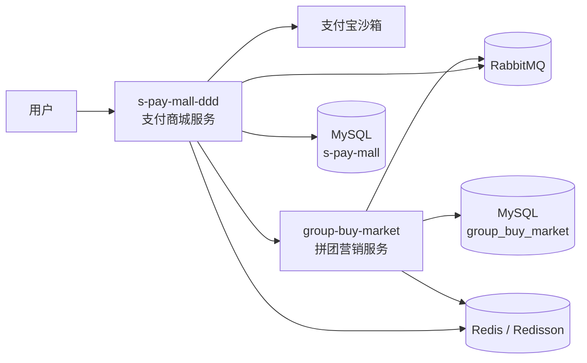

# DDD 交易营销平台

基于 Java 17、Spring Boot 2.7.12 和 DDD 分层实践构建的交易营销工作区，包含两个独立 Maven 多模块项目：

- `s-pay-mall-ddd/`：支付商城服务，负责登录、商品下单、支付宝支付/回调、订单履约、退款和补偿任务。
- `group-buy-market/`：拼团营销服务，负责拼团活动试算、锁单、成团结算、超时退单、通知任务和营销侧 MQ 事件处理。

仓库重点展示交易系统中的状态流转、跨服务协作、MQ 消息驱动、定时补偿、分布式锁和异常场景一致性验证。

## 业务关系



核心链路：

1. 用户在商城侧创建支付订单。
2. 商城调用营销服务完成拼团锁单或结算。
3. 支付宝回调推动订单进入支付成功状态。
4. 拼团成团、履约、退款成功等事件通过 RabbitMQ 在两个服务之间传递。
5. 定时任务和任务表负责处理未支付关闭、退款补偿、营销通知和超时退单。

## 项目结构

```text
.
├── group-buy-market/                 # 拼团营销服务
│   ├── group-buy-market-lpc-api/      # 对外接口与 DTO
│   ├── group-buy-market-lpc-app/      # Spring Boot 启动模块与测试
│   ├── group-buy-market-lpc-domain/   # 拼团、结算、退单等领域规则
│   ├── group-buy-market-lpc-trigger/  # HTTP、MQ Listener、Job 触发入口
│   ├── group-buy-market-lpc-infrastructure/
│   │                                   # MyBatis、Redis、MQ、外部服务适配
│   └── group-buy-market-lpc-types/    # 公共类型、枚举、异常
├── s-pay-mall-ddd/                    # 支付商城服务
│   ├── s-pay-mall-ddd-lpc-api/        # 对外接口与 DTO
│   ├── s-pay-mall-ddd-lpc-app/        # Spring Boot 启动模块与测试
│   ├── s-pay-mall-ddd-lpc-domain/     # 订单、支付、退款、履约领域规则
│   ├── s-pay-mall-ddd-lpc-trigger/    # HTTP、MQ Listener、Job 触发入口
│   ├── s-pay-mall-ddd-lpc-infrastructure/
│   │                                   # MyBatis、支付宝、营销服务、MQ 适配
│   └── s-pay-mall-ddd-lpc-types/      # 公共类型、枚举、异常
├── docs/dev-ops/                      # 本地环境、Nginx、MySQL、Redis、RabbitMQ 配置
└── code_copilot/                      # Spec 驱动协作规范、变更记录和知识沉淀
```

根目录没有 Maven 聚合 `pom.xml`，两个子项目需要分别进入目录构建和运行。

## 核心能力

### 商城侧 `s-pay-mall-ddd`

- 微信登录二维码、登录态校验。
- 商品下单与订单列表查询。
- 支付宝沙箱支付单创建、支付结果回调验签。
- 普通订单与拼团订单的支付成功状态推进。
- 订单退款申请、退款成功消息处理、退款任务表补偿。
- 未支付订单关闭、未收到支付通知订单查询补偿、订阅履约任务。

### 营销侧 `group-buy-market`

- 拼团活动配置查询与动态配置更新。
- 拼团锁单、成团结算、营销退单。
- 成团成功、退款成功 MQ 事件处理。
- 基于 Redisson 的营销通知任务互斥执行。
- 超时未支付订单退单补偿。
- 基于注解的接口限流拦截。

### 跨服务一致性关注点

- 支付成功、成团成功、退款成功等事件的重复触发风险。
- MQ 重复投递和 Listener 重复消费。
- 退款任务表抢占与重试。
- 定时任务多实例执行的互斥控制。
- 拼团结算、通知任务、订单履约等关键副作用是否重复发生。

## 技术栈

| 分类 | 技术 |
| --- | --- |
| 语言与框架 | Java 17, Spring Boot 2.7.12 |
| 构建 | Maven 多模块 |
| 领域建模 | DDD 分层：api / app / domain / trigger / infrastructure / types |
| 数据访问 | MyBatis, MySQL 8 |
| 缓存与锁 | Redis, Redisson |
| 消息 | RabbitMQ |
| 支付与外部接口 | Alipay SDK, Retrofit, OkHttp |
| 测试 | JUnit, Mockito, Spring Boot Test |
| 部署辅助 | Docker Compose, Nginx |

## 本地运行

### 1. 环境要求

- JDK 17
- Maven 3.8+
- Docker / Docker Compose
- MySQL、Redis、RabbitMQ 可通过仓库内 Docker Compose 启动

### 2. 启动基础设施

```bash
docker compose -f docs/dev-ops/docker-compose-environment.yml up -d
```

该配置包含 MySQL、Redis、RabbitMQ、Nginx 等本地依赖。首次启动后，需要确认 `docs/dev-ops/mysql/sql/` 下的初始化 SQL 已正确导入：

- `docs/dev-ops/mysql/sql/s-pay-mall.sql`
- `docs/dev-ops/mysql/sql/2-28-group_buy_market.sql`

### 3. 构建服务

```bash
cd s-pay-mall-ddd
mvn clean package

cd ../group-buy-market
mvn clean package
```

### 4. 启动应用

可以在 IDE 中分别启动：

- `s-pay-mall-ddd/s-pay-mall-ddd-lpc-app/src/main/java/top/licodetech/mall/Application.java`
- `group-buy-market/group-buy-market-lpc-app/src/main/java/top/licodetech/market/Application.java`

常用本地端口：

- 商城服务：`8080`
- 营销服务：`8091`

具体端口、数据库、MQ、Redis、第三方回调地址以各自 `*-lpc-app/src/main/resources/application-*.yml` 为准。

## 常用接口

### 商城服务

| 能力 | 路径 |
| --- | --- |
| 创建支付订单 | `POST /api/v1/alipay/create_pay_order` |
| 查询用户订单 | `POST /api/v1/alipay/query_user_order_list` |
| 申请退款 | `POST /api/v1/alipay/refund_order` |
| 支付宝回调 | `POST /api/v1/alipay/alipay_notify_url` |
| 拼团成交通知 | `POST /api/v1/alipay/group_buy_notify` |
| 微信登录二维码 | `GET /api/v1/login/weixin_qrcode_ticket` |
| 微信公众号回调 | `GET/POST /api/v1/weixin/portal/receive` |

### 营销服务

| 能力 | 路径 |
| --- | --- |
| 查询营销配置 | `POST /api/v1/gbm/index/query_group_buy_market_config` |
| 锁定拼团支付单 | `POST /api/v1/gbm/trade/lock_market_pay_order` |
| 结算拼团支付单 | `POST /api/v1/gbm/trade/settlement_market_pay_order` |
| 营销退单 | `POST /api/v1/gbm/trade/refund_market_pay_order` |
| 更新动态配置 | `GET /api/v1/gbm/dcc/update_config` |
| 标签推送 | `/api/v1/gbm/tag/tag_push` |

## 测试与验证

普通模块测试：

```bash
cd s-pay-mall-ddd
mvn test

cd ../group-buy-market
mvn test
```

推荐重点补充和复核的交易一致性场景：

- 重复支付成功推进。
- 支付成功 MQ 重复消费。
- 成团 MQ 重复消费。
- 退款成功消息重复处理与退款任务抢占。
- `GroupBuyNotifyJob`、`TimeoutRefundJob` 的 Redisson 锁成功/失败分支。

这些场景适合用于识别幂等边界和补偿机制效果。若只完成本地 Mock 或单元测试，结论不应外推为“支付回调/MQ 全链路已经完全幂等”或“线上高并发 SLA 已验证”。

## 配置安全

仓库中的运行配置可能包含本地或沙箱环境字段。推送到公开 GitHub 前建议重点检查：

- 不提交真实 `.env`、私钥、AppSecret、支付密钥、数据库密码。
- 支付宝、微信等第三方配置在公开仓库中使用占位符或示例值。
- 生产域名、回调地址、账号密码按部署环境单独注入。

## 适合展示的工程亮点

- 双服务 DDD 分层工程，清晰拆分商城交易与拼团营销边界。
- 支付、拼团、退款、履约、MQ、Job 共同构成完整交易链路。
- 使用 RabbitMQ 承载跨服务事件，使用 Redis/Redisson 处理限流和定时任务互斥。
- 通过 `pay_refund_task` 等任务表承载失败补偿和最终一致性。
- 对重复支付、重复 MQ、退款补偿、多实例 Job 等异常场景具备清晰的验证锚点。
- `code_copilot/` 保留 Spec 驱动变更记录，便于追踪需求、风险、验证结果和后续增强项。

## 后续增强方向

- 支付成功状态推进增加更严格的前置状态条件。
- MQ 消费侧补充业务幂等键、任务表或唯一约束。
- 拼团成团通知任务补充唯一约束或 `insert ignore` 防重复策略。
- 在隔离数据库中补充真实并发结算、退款与履约交错场景验证。
- 将敏感配置迁移到环境变量、密钥管理或部署平台配置中心。

## License

本项目遵循 Apache License 2.0。
