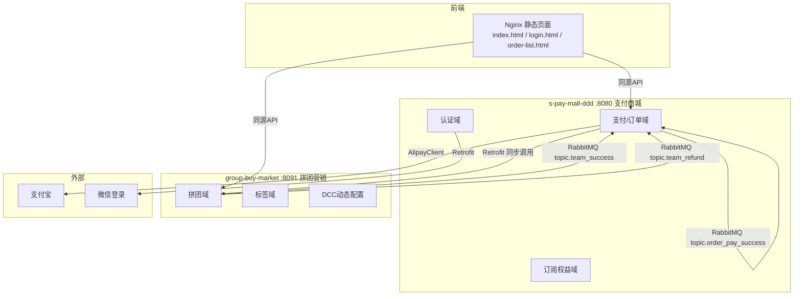
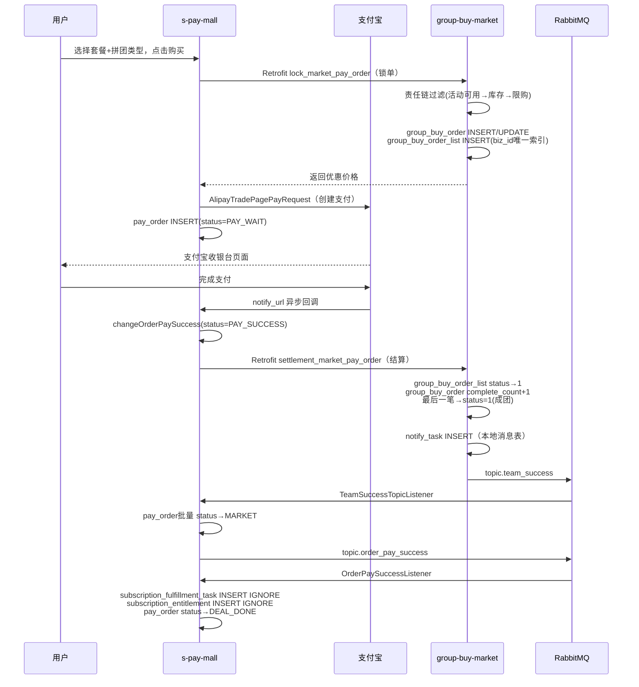
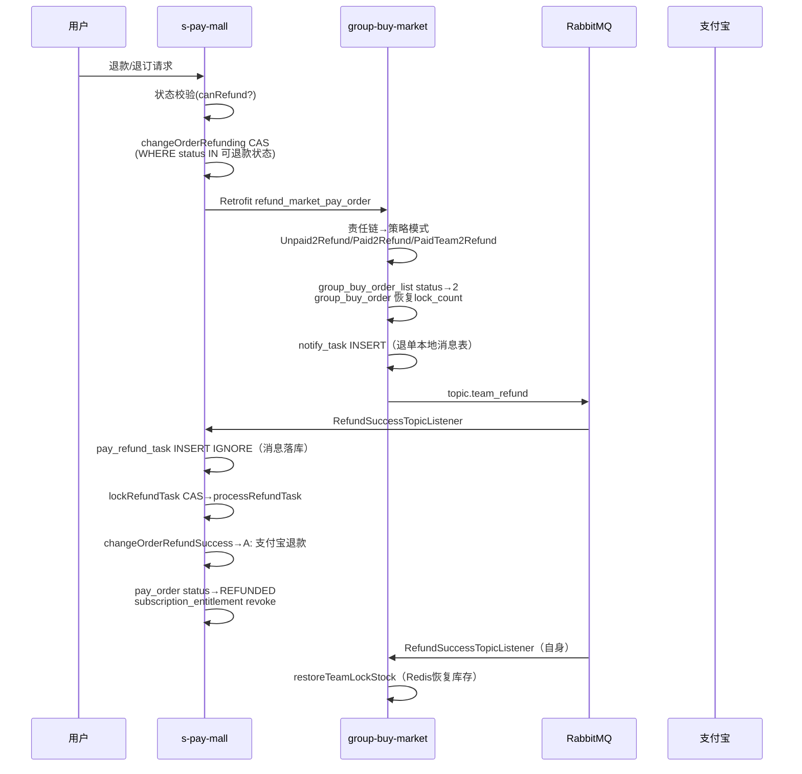
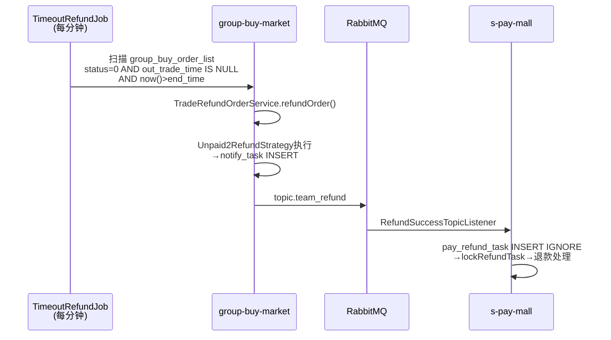

# 面试复习文档 — AI 服务订阅与营销平台

> 基于 `group-buy-market` 和 `s-pay-mall-ddd` 两个 Java DDD 项目的真实代码。

---

## 一、项目介绍（30 秒版本）

这是一个 **AI 服务订阅平台**，用户可以在上面购买大模型调用额度套餐，支持**单独购买**和**拼团购买**两种方式。拼团成功后有优惠折扣，支付通过支付宝完成，支付成功后系统自动开通额度权益。

技术栈：Java 17 + Spring Boot 2.7.12 + Maven 多模块 DDD 六边形架构 + MyBatis + RabbitMQ + Redis/Redisson + MySQL + Docker Compose 部署。

项目是我从零搭建的，两个独立的微服务（拼团营销服务 `group-buy-market` 和支付商城服务 `s-pay-mall-ddd`），通过 Retrofit 同步调用 + RabbitMQ 异步消息协作，没有使用 Spring Cloud 全家桶，而是**手工实现了跨服务的最终一致性**。

---

## 二、业务架构



**服务职责**：

| 服务 | 职责 | 独立数据库 |
|------|------|-----------|
| `s-pay-mall-ddd` | 商品查询、下单、支付宝支付/退款、微信登录、订阅权益开通/撤销/履约 | `s-pay-mall`（4 张表） |
| `group-buy-market` | 拼团活动配置、锁单、成团结算、退单、人群标签、动态配置（DCC） | `group_buy_market`（10 张表） |

**关键约束**：两个服务**不共享数据库、不共享事务边界**。跨服务操作只能通过 API / MQ / Job 补偿。

---

## 三、DDD 模块分层

每个服务都是标准的 **Maven 多模块 DDD 六边形架构**：

```
*-lpc-api/          → 接口契约（Service 接口 + DTO），供外部消费者依赖
*-lpc-app/          → Spring Boot 启动 + 配置类 + MyBatis XML
*-lpc-domain/       → 领域模型：Entity、Aggregate、VO、Domain Service、Repository 接口、Port 接口
*-lpc-trigger/      → 入站适配器：Controller、MQ Listener、定时 Job
*-lpc-infrastructure/ → 出站适配器：DAO/PO、Repository 实现、Port 实现、网关、MQ 生产者
*-lpc-types/        → 公共类型：枚举、常量、异常、事件基类
```

**依赖方向**：`app → trigger + infrastructure`，`trigger → api + domain`，`infrastructure → domain`，`domain → types`。domain 不依赖任何框架细节（没有 Spring、MyBatis、RabbitMQ 的 import）。

---

## 四、核心业务流程

### 4.1 正向流程：下单 → 支付 → 成团 → 履约



### 4.2 逆向流程：用户退单



### 4.3 补偿流程：超时未支付自动退单



---

## 五、状态机设计

### 5.1 支付订单状态（`pay_order.status`）

```
                  ┌──────────┐
                  │  CREATE  │ 创建订单
                  └────┬─────┘
                       │ 创建支付宝支付单
                       ▼
                  ┌──────────┐
          ┌───────│ PAY_WAIT │ 等待支付
          │       └────┬─────┘
          │            │ 支付宝回调
          │            ▼
          │       ┌────────────┐
          │       │ PAY_SUCCESS│ 支付成功
          │       └─────┬──────┘
          │            │ 拼团结算/MQ回调
          │            ▼
          │       ┌──────────┐
          │       │  MARKET  │ 营销结算完成
          │       └────┬─────┘
          │            │ 履约开通权益
          │            ▼
          │       ┌──────────┐
          │       │DEAL_DONE │ 交易完成
          │       └──────────┘
          │
          │  30分钟超时
          ▼
     ┌──────────┐
     │  CLOSE   │ 超时关单
     └──────────┘

任一状态(PAY_WAIT/PAY_SUCCESS/MARKET/DEAL_DONE) ──→ REFUNDING ──→ REFUNDED
```

**退款状态流转的核心 CAS SQL**：

```sql
-- 进入 REFUNDING（只能从可退款状态进入）
UPDATE pay_order SET status='REFUNDING'
WHERE order_id=? AND user_id=?
  AND status IN ('PAY_WAIT','PAY_SUCCESS','MARKET','DEAL_DONE')

-- 进入 REFUNDED（只能从 REFUNDING 进入）
UPDATE pay_order SET status='REFUNDED'
WHERE order_id=? AND status='REFUNDING'
```

### 5.2 拼团团队状态（`group_buy_order.status`）

```
0 PROGRESS ────────→ 1 COMPLETE       成团（最后一笔结算）
0 PROGRESS ────────→ 2 FAIL           已支付未成团退单（最后一人退）
1 or 3 ───────────→ 3 COMPLETE_FAIL  成团后退单（非最后一人）
1 or 3 ───────────→ 2 FAIL           成团后退单（最后一人）
```

### 5.3 拼团订单明细状态（`group_buy_order_list.status`）

```
0 待支付 ──→ 1 已支付(成团) ──→ 2 已退单
0 待支付 ──→ 2 已退单(超时未支付)
```

### 5.4 退款任务状态（`pay_refund_task.status`）

```
PENDING ──→ PROCESSING ──→ SUCCESS
   │            │
   └──→ RETRY ←─┘ (可恢复失败)
                │
                └──→ FAILED (永久失败：订单不存在/状态不允许/退单类型缺失)
```

`lockRefundTask` SQL 同时处理新任务和僵死恢复：
```sql
UPDATE pay_refund_task SET status='PROCESSING', update_time=now()
WHERE order_id=?
  AND (
    status IN ('PENDING','RETRY') AND (next_retry_time IS NULL OR next_retry_time <= now())
    OR (status='PROCESSING' AND update_time < now() - INTERVAL 5 MINUTE)
  )
```

### 5.5 履约任务状态（`subscription_fulfillment_task.status`）

```
PENDING ──→ PROCESSING ──→ SUCCESS（权益开通完成）
   │            │
   └──→ RETRY ←─┘ (retry_count+1, next_retry_time=now()+1s)
                │
                └──→ FAILED (超过3次重试 或 超过5秒 → autoRefund)
```

---

## 六、最终一致性方案

### 6.1 核心架构思路

两个服务各有独立的数据库，跨服务操作通过 **"同步调用推进 + MQ 异步解耦 + 本地消息表 + 定时补偿"** 四件套实现最终一致性。

### 6.2 同步调用（Retrofit）

`IGroupBuyMarketService`（在 `s-pay-mall/infrastructure/gateway/` 下）封装了三个同步 HTTP 调用：

| 调用 | 时机 | 推进的核心状态 |
|------|------|---------------|
| `lock_market_pay_order` | 下单时 | group_buy_order INSERT/UPDATE + group_buy_order_list INSERT（biz_id 唯一索引防重） |
| `settlement_market_pay_order` | 支付宝回调后 | group_buy_order_list status→1 + group_buy_order complete_count+1 + 成团时写入 notify_task |
| `refund_market_pay_order` | 用户退单时 | 策略模式执行 unpaid2Refund/paid2Refund/paidTeam2Refund + notify_task INSERT |

**如果同步调用失败怎么办？** 抛异常 → 上游的支付宝回调重试 + NoPayNotifyOrderJob（每分钟）补偿。这就是"推进"语义而非"保证"语义。

### 6.3 异步消息（RabbitMQ）

三条 Topic：

| Topic | 交换机 | 生产者 | 消费者 | 解耦什么 |
|-------|--------|--------|--------|---------|
| `topic.team_success` | `group_buy_market_exchange` | group-buy-market | s-pay-mall `TeamSuccessTopicListener` | 成团通知 → 订单结算 + 触发履约 |
| `topic.team_refund` | `group_buy_market_exchange` | group-buy-market | s-pay-mall `RefundSuccessTopicListener` + group-buy-market 自己的 `RefundSuccessTopicListener` | 退单完成 → 支付宝退款 + 权益撤销 + Redis 库存恢复 |
| `topic.order_pay_success` | `s_pay_mall_exchange` | s-pay-mall | s-pay-mall `OrderPaySuccessListener` | 支付/成团 → 履约开通权益 |

### 6.4 本地消息表（`notify_task`）

位于 group_buy_market 数据库。四种通知类别：
- `TRADE_SETTLEMENT` — 成团通知
- `TRADE_UNPAID2REFUND` / `TRADE_PAID2REFUND` / `TRADE_PAID_TEAM2REFUND` — 退单通知

**工作方式**：
1. 拼团状态变更时**先写 `notify_task` 记录在同一个本地事务中**
2. 异步（线程池或定时任务）发送 MQ/HTTP 通知
3. 更新 `notify_status`：1=成功, 2=重试, 3=失败
4. 通知次数 > 4 次标记为 ERROR，不再重试

### 6.5 退款任务表（`pay_refund_task`）

位于 s-pay-mall 数据库。采用 **"MQ 消息先落库，再异步处理"** 模式：

```
RefundSuccessTopicListener 收到 MQ
  → pay_refund_task INSERT IGNORE（可靠落库，幂等）
  → processRefundTask()
    → lockRefundTask CAS（分布式互斥）
    → changeOrderRefundSuccess()（多层状态校验+退款执行）
    → 成功 → markRefundTaskSuccess
    → 失败 → markRefundTaskRetry（指数退避重试）或 markRefundTaskFailed（永久失败）
```

`RefundTaskJob`（每分钟）扫描待处理/重试/僵死任务补偿执行。

### 6.6 定时补偿

| Job | 频率 | 补偿什么 | 分布式互斥 |
|-----|------|---------|-----------|
| `GroupBuyNotifyJob` | 每天午夜 | notify_task 未发送的通知 | Redisson tryLock |
| `TimeoutRefundJob` | 每分钟 | 超时未支付的拼团订单自动退单 | Redisson tryLock |
| `NoPayNotifyOrderJob` | 每分钟 | 支付成功但未通知的订单 | 待确认 |
| `TimeoutCloseOrderJob` | 每 30 分钟 | 超时 30 分钟未支付订单自动关闭 | 待确认 |
| `RefundTaskJob` | 每分钟 | pay_refund_task 待处理/重试/僵死任务 | DB CAS lockRefundTask |
| `SubscriptionFulfillmentTaskJob` | 每 1 秒 | 履约任务重试 + 超阈值自动退款 | DB CAS lockTask |

---

## 七、幂等设计的五层防护

```
第1层: 业务入口判状态（isRefunded/isRefunding/canRefund/status==SUCCESS）
第2层: INSERT IGNORE + 唯一索引（biz_id, uq_order_package, pay_refund_task）
第3层: UPDATE WHERE status=条件 + 判断影响行数（CAS 乐观锁）
第4层: 分布式锁（Redisson tryLock / Redis setNx）
第5层: 定时 Job 兜底补偿
```

### 具体场景的幂等点

**支付宝回调重复**：
- `OrderService.changeOrderPaySuccess()` 先判 `if (null == orderEntity) return`
- 下游 group-buy-market `updateOrderStatus2COMPLETE` CAS `WHERE out_trade_no=? AND user_id=?` — 同一笔只能结算一次

**MQ 重复消费（team_refund）**：
- `pay_refund_task` INSERT IGNORE — 重复消息只落一条
- `lockRefundTask` CAS — 只有一个实例抢到
- `changeOrderRefundSuccess()` 内部分三步 CAS 判重

**定时 Job 多实例重复**：
- group-buy-market 的 Job 用 Redisson 分布式锁（`tryLock(3s, 60s)`）
- s-pay-mall 的 Job 用数据库行锁 CAS（`lockRefundTask`、`lockTask`）

**履约开通重复**：
- `subscription_fulfillment_task` INSERT IGNORE
- `subscription_entitlement` INSERT IGNORE（唯一索引 `uq_order_package` 基于 order_id + service_package_id）
- `processFulfillmentTask()` 入口判 `status == SUCCESS` → 直接返回

**库存恢复重复**：
- Redis `setNx("refund_lock_" + orderId, 30天)` — 同一订单只恢复一次

---

## 八、技术难点与设计选择

### 8.1 跨服务数据一致性

**问题**：用户支付成功后，s-pay-mall 要把订单状态改为 PAY_SUCCESS，group-buy-market 要把拼团订单改为"已支付"并判断是否成团。两个数据库，不能用一个事务。

**方案**：
1. s-pay-mall 先改自己的状态
2. 通过 Retrofit 同步调用 group-buy-market 的结算接口
3. group-buy-market 在自己的本地事务中更新拼团状态 + 写入 notify_task
4. 异步发送 MQ 通知 s-pay-mall 更新 MARKT 状态
5. 如果第 2 步失败，抛异常触发支付宝回调重试 + NoPayNotifyOrderJob 定时补偿

**为什么不用 Seata 之类的分布式事务？** 这个项目跑在两个轻量级服务上，没有引入额外的分布式事务框架。通过本地消息表 + 定时补偿实现了最终一致性，复杂度可控，也更容易排查问题。

### 8.2 退单的策略模式

三种退单类型对应三种业务逻辑：
- `Unpaid2RefundStrategy` — 未支付退单：恢复 lock_count，不恢复 complete_count
- `Paid2RefundStrategy` — 已支付未成团退单：恢复 lock_count + complete_count
- `PaidTeam2RefundStrategy` — 已成团退单：需要区分"最后一人退单"和"非最后一人"，前者团队标 FAIL，后者标 COMPLETE_FAIL

每种策略都实现 `IRefundOrderStrategy` 接口，通过 `Map<String, IRefundOrderStrategy>` 注入，由 `RefundTypeEnumVO.getStrategy()` 路由。

### 8.3 履约失败自动退款

履约任务表 `subscription_fulfillment_task` 的设计：
- 最多重试 3 次，每次间隔 1 秒
- 总时间超过 5 秒 → `autoRefund=true`
- `SubscriptionFulfillmentTaskJob`（每 1 秒）扫描 + `lockTask` CAS
- autoRefund 触发 `OrderService.refundOrder()` → 走完整的退单链路

退款金额计算（`SubscriptionService.calculateRefundAmount()`）：
```
refundAmount = payAmount × remainingQuota / totalQuota
最低退款 0.01 元，额度全部消耗 → 退款 0 元（跳过支付宝退款）
```

### 8.4 库存占用的 Redis 无锁化设计

`occupyTeamStock()` 方法：
1. Redis `incr` 原子操作做计数
2. `occupy > target + recoveryCount` 时 `decr` 回退
3. 对 `teamStockKey_occupy` 值做 `setNx` 加锁作为**兜底**（生产环境遇到过 incr 值碰撞）

这个设计避免了直接用 Redis 分布式锁从而引入高并发瓶颈，incr 操作本身就是原子的。

---

## 九、设计模式应用

| 模式 | 位置 | 解决什么问题 |
|------|------|-------------|
| **策略模式** | group-buy-market 退单 `AbstractRefundOrderStrategy` + 3 实现 | 三种退单类型的差异化库存恢复逻辑 |
| **策略模式** | group-buy-market 折扣 `AbstractDiscountCalculateService` + 4 实现（MJ/N/ZJ/ZK） | 满减/N元购/直减/折扣的试算 |
| **责任链模式** | group-buy-market 锁单 `TradeLockRuleFilterFactory` + 3 过滤器 | 活动可用性→库存占用→用户限购 |
| **责任链模式** | group-buy-market 结算 `TradeSettlementRuleFilterFactory` + 4 过滤器 | End→OutTradeNo→SC→Settable |
| **责任链模式** | group-buy-market 退单 `TradeRefundRuleFilterFactory` + 3 过滤器 | Data→RefundOrder→UniqueRefund |
| **模板方法** | s-pay-mall `AbstractOrderService` → `OrderService` | 下单骨架：查单→锁营销→创建支付单 |

---

## 十、高频面试追问

### Q1: 下单时如果用户已经在团里了，怎么处理？

**答**：`AbstractOrderService.createOrder()` 第一步先调 `queryUnPayOrder`，按 `userId + productId` 查最近一条未支付订单。如果存在且状态是 `PAY_WAIT`（已经有支付链接），直接返回已有支付链接，不重复创建。如果状态是 `CREATE`（订单创建了但支付单还没创建，即"掉单"），复用已有订单重新创建支付单。只有都没有时才走完整下单流程。

### Q2: `biz_id` 唯一索引是干什么的？

**答**：`biz_id` = `activityId_userId_userTakeOrderCount+1`。它保证了同一个用户在同一活动上只能参与固定的次数（配合 `userTakeOrderCount` 递增）。如果并发下单，第二个插入会因为 `DuplicateKeyException` 失败，抛出 `INDEX_EXCEPTION`。这个唯一索引是在数据库层面兜底，防止 Redis 限购检查穿透。

### Q3: 如果支付宝回调了但是调用 group-buy-market 结算接口失败了怎么办？

**答**：结算 HTTP 调用会抛异常，导致 `changeOrderPaySuccess()` 整体回滚（但 pay_order 的状态已经改成 PAY_SUCCESS 了——这里有个细节：`changeMarketOrderPaySuccess` 是在判断是拼团订单后单独调用的，只改了 pay_order 状态。如果后续 `settlementMarketPayOrder` 失败，异常会抛给支付宝回调，支付宝会重试。同时 `NoPayNotifyOrderJob` 每分钟扫描 `PAY_WAIT` 超过 1 分钟的订单做兜底补偿。

### Q4: 成团后 MQ 发了，但 s-pay-mall 消费失败怎么办？

**答**：MQ 消费者 `TeamSuccessTopicListener` 如果抛异常，消息不会被确认，RabbitMQ 会重试投递。`prefetch=1` 保证了一次只投递一条。重试多次后如果还失败，消息会进入死信队列（前提是配置了死信）。但我们的 `changeOrderMarketSettlement` SQL 是无条件批量 SET status='MARKT' 的，本身就是幂等的，重复消费不会有副作用。

### Q5: 退单时退款任务执行到一半实例崩溃了怎么办？

**答**：`lockRefundTask` 的 CAS SQL 处理了这种情况：
```sql
OR (status='PROCESSING' AND update_time < now() - INTERVAL 5 MINUTE)
```
5 分钟没有更新的 PROCESSING 任务会被认为是僵死任务，`RefundTaskJob` 会重新锁定并执行。执行过程中任何一步失败都会根据异常类型决定是标记 RETRY（指数退避重试）还是 FAILED（永久失败）。

### Q6: 为什么不直接用 Spring Cloud / Seata？

**答**：这个项目现阶段只有两个服务，规模不大。引入分布式事务框架会增加运维复杂度和学习成本。我选择了"同步调用推进 + 本地消息表 + MQ 异步解耦 + 定时补偿"的方案，代码层面完全可控，出问题也能快速定位。如果将来服务数量增多，可以考虑引入 Seata 的 AT 模式或 Saga 模式。

### Q7: 履约为什么要单独一张任务表？不能直接在支付回调里做完吗？

**答**：支付回调是支付宝调我们的 HTTP 接口，响应时间有限制。如果把权益开通放在回调里同步执行，一旦开通逻辑变慢（比如调外部服务），可能超时导致支付宝判定回调失败、重复回调。所以我用 `subscription_fulfillment_task` 表把"收到支付成功"和"执行权益开通"解耦了：回调里只负责落一条任务记录（INSERT IGNORE），然后异步（MQ → Job）处理。这样回调接口毫秒级返回，权益开通可以重试、可以补偿。

### Q8: `notify_task.uuid` 为什么不是唯一索引？

**答**：这是代码中的已知问题（注释里明确写了这不是 UNIQUE KEY）。uuid 的构造规则是 `{teamId}_{notifyCategory}_{outTradeNo}`。如果同一次退单被重复执行（比如定时任务扫到了、同时又收到了 MQ），同一个 uuid 的 notify_task 会被重复 INSERT。好在这不影响业务正确性——上游的 group_buy_order_list 状态变更是 CAS 的，只有第一次能成功；通知本身也是幂等的（MQ/HTTP 重复发送不会产生副作用）。

### Q9: 拼团锁单时，`updateAddLockCount` 返回 0 行怎么处理？

**答**：SQL 是 `UPDATE group_buy_order SET lock_count=lock_count+1 WHERE team_id=? AND lock_count < target_count`。如果返回 0，说明 team 已经满员了，直接抛 `E0005` 异常，锁单失败。上层 `TradeLockOrderService.lockMarketPayOrder()` 的 catch 块会调 `recoveryTeamStock()` 把 Redis 中的恢复量 incr 上去，确保库存不丢。

---

## 十一、项目亮点（适合面试主动提及）

1. **手工实现跨服务最终一致性**：没有用分布式事务框架，靠 Retrofit + MQ + 本地消息表（`notify_task`）+ 退款任务表（`pay_refund_task`）+ 5 个定时 Job，实现了一套完整的补偿机制。

2. **五层幂等防护**：从业务入口判状态到数据库唯一索引到 CAS 乐观锁到分布式锁到 Job 兜底，每一层各司其职。

3. **DDD 六边形架构**：两个服务都是标准的 API / APP / DOMAIN / TRIGGER / INFRASTRUCTURE / TYPES 六模块分层，domain 层零框架依赖，Port/Adapter 模式实现依赖倒置。

4. **三种退单策略 + 责任链编排**：策略模式处理差异化退单逻辑，责任链模式编排过滤规则，新增退单类型只需加策略类和枚举映射。

5. **Redis 无锁化库存设计**：incr 原子操作 + setNx 兜底锁，避免分布式锁热 key 瓶颈。

6. **履约任务精妙的重试与自动退款**：最多重试 3 次，间隔 1 秒，总共 5 秒窗口，超阈值自动走完整退款链路。

7. **CAS 锁支持僵死任务恢复**：退款任务和履约任务的 lock SQL 都包含 `OR (status='PROCESSING' AND update_time < 阈值)`，防止实例崩溃导致任务永远卡在 PROCESSING。

---

## 十二、项目不足与优化方向（面试展示思考深度）

| 不足 | 优化方向 |
|------|---------|
| `notify_task.uuid` 不是唯一索引，理论上可能重复插入 | 加上 UNIQUE KEY 或改为 `INSERT IGNORE`，消除边缘风险 |
| `changeOrderPaySuccess` SQL 无 CAS 条件 | 加上 `WHERE status='PAY_WAIT'`，防止已退款订单被覆盖回 PAY_SUCCESS |
| `changeOrderMarketSettlement` 批量更新无条件 | 加上 `WHERE status='PAY_SUCCESS'` 的前置条件 |
| MQ 消费者未显式配置死信队列 | 添加死信队列 + 死信消费者，防止消息无限重试 |
| 履约 Job 每 1 秒执行，高频查库 | 可改为延迟队列或时间轮，减少空扫 |
| `TimeoutCloseOrderJob` 只关单不退营销侧库存 | 关单时应同步调 group-buy-market 的退单接口恢复 lock_count |
| 缺少链路追踪 | 引入 TraceId（已有 `TraceIdFilter` 骨架），全链路透传 |
| `NoPayNotifyOrderJob` 实际处理逻辑不完整 | 代码中只查到 order_id 列表但未看到后续处理，需要完善 |

---

## 十三、关键代码位置索引

### s-pay-mall-ddd 关键文件

| 功能 | 文件路径 |
|------|---------|
| 启动类 | `s-pay-mall-ddd-lpc-app/src/main/java/top/licodetech/mall/Application.java` |
| 支付 Controller | `s-pay-mall-ddd-lpc-trigger/.../trigger/http/AliPayController.java` |
| 订单领域服务 | `s-pay-mall-ddd-lpc-domain/.../domain/order/service/OrderService.java` |
| 订单抽象服务 | `s-pay-mall-ddd-lpc-domain/.../domain/order/service/AbstractOrderService.java` |
| 订单状态枚举 | `s-pay-mall-ddd-lpc-domain/.../domain/order/model/valobj/OrderStatusVO.java` |
| 订单 DAO | `s-pay-mall-ddd-lpc-infrastructure/.../infrastructure/dao/IOrderDao.java` |
| 订单表 Mapper XML | `s-pay-mall-ddd-lpc-app/src/main/resources/mybatis/mapper/pay_order_mapper.xml` |
| 退款任务 DAO | `s-pay-mall-ddd-lpc-infrastructure/.../infrastructure/dao/IRefundTaskDao.java` |
| 退款任务 Mapper | `s-pay-mall-ddd-lpc-app/src/main/resources/mybatis/mapper/refund_task_mapper.xml` |
| 支付宝 Port 实现 | `s-pay-mall-ddd-lpc-infrastructure/.../infrastructure/adapter/port/RefundPort.java` |
| 订阅履约服务 | `s-pay-mall-ddd-lpc-domain/.../domain/subscription/service/SubscriptionService.java` |
| 履约任务 Mapper | `s-pay-mall-ddd-lpc-app/src/main/resources/mybatis/mapper/subscription_fulfillment_task_mapper.xml` |
| 权益 Mapper | `s-pay-mall-ddd-lpc-app/src/main/resources/mybatis/mapper/subscription_entitlement_mapper.xml` |
| MQ 配置 | `s-pay-mall-ddd-lpc-app/.../config/RabbitMQConfig.java` |
| MQ 生产者 | `s-pay-mall-ddd-lpc-infrastructure/.../infrastructure/event/EventPublisher.java` |
| TeamSuccess 监听 | `s-pay-mall-ddd-lpc-trigger/.../trigger/listener/TeamSuccessTopicListener.java` |
| RefundSuccess 监听 | `s-pay-mall-ddd-lpc-trigger/.../trigger/listener/RefundSuccessTopicListener.java` |
| OrderPaySuccess 监听 | `s-pay-mall-ddd-lpc-trigger/.../trigger/listener/OrderPaySuccessListener.java` |
| RefundTaskJob | `s-pay-mall-ddd-lpc-trigger/.../trigger/job/RefundTaskJob.java` |
| 履约任务 Job | `s-pay-mall-ddd-lpc-trigger/.../trigger/job/SubscriptionFulfillmentTaskJob.java` |
| 超时关单 Job | `s-pay-mall-ddd-lpc-trigger/.../trigger/job/TimeoutCloseOrderJob.java` |
| 支付通知兜底 Job | `s-pay-mall-ddd-lpc-trigger/.../trigger/job/NoPayNotifyOrderJob.java` |
| 拼团网关接口 | `s-pay-mall-ddd-lpc-infrastructure/.../infrastructure/gateway/IGroupBuyMarketService.java` |
| 订单仓储实现 | `s-pay-mall-ddd-lpc-infrastructure/.../infrastructure/adapter/repository/OrderRepository.java` |

### group-buy-market 关键文件

| 功能 | 文件路径 |
|------|---------|
| 启动类 | `group-buy-market-lpc-app/src/main/java/top/licodetech/market/Application.java` |
| 交易 Controller | `group-buy-market-lpc-trigger/.../trigger/http/MarketTradeController.java` |
| 锁单服务 | `group-buy-market-lpc-domain/.../domain/trade/service/lock/TradeLockOrderService.java` |
| 结算服务 | `group-buy-market-lpc-domain/.../domain/trade/service/settlement/TradeSettlementOrderService.java` |
| 退单服务 | `group-buy-market-lpc-domain/.../domain/trade/service/refund/TradeRefundOrderService.java` |
| 通知任务服务 | `group-buy-market-lpc-domain/.../domain/trade/service/task/TradeTaskService.java` |
| 退单策略接口 | `group-buy-market-lpc-domain/.../domain/trade/service/refund/business/IRefundOrderStrategy.java` |
| 锁单责任链工厂 | `group-buy-market-lpc-domain/.../domain/trade/service/lock/factory/TradeLockRuleFilterFactory.java` |
| 结算责任链工厂 | `group-buy-market-lpc-domain/.../domain/trade/service/settlement/factory/TradeSettlementRuleFilterFactory.java` |
| 退单责任链工厂 | `group-buy-market-lpc-domain/.../domain/trade/service/refund/factory/TradeRefundRuleFilterFactory.java` |
| 拼团订单 Mapper | `group-buy-market-lpc-app/src/main/resources/mybatis/mapper/group_buy_order_mapper.xml` |
| 拼团明细 Mapper | `group-buy-market-lpc-app/src/main/resources/mybatis/mapper/group_buy_order_list_mapper.xml` |
| 通知任务 Mapper | `group-buy-market-lpc-app/src/main/resources/mybatis/mapper/nofify_task_mapper.xml` |
| 交易仓储实现 | `group-buy-market-lpc-infrastructure/.../infrastructure/adapter/repository/TradeRepository.java` |
| MQ 配置 | `group-buy-market-lpc-app/.../config/RabbitMQConfig.java` |
| MQ 生产者 | `group-buy-market-lpc-infrastructure/.../infrastructure/event/EventPublisher.java` |
| RefundSuccess 监听 | `group-buy-market-lpc-trigger/.../trigger/listener/RefundSuccessTopicListener.java` |
| TeamSuccess 监听 | `group-buy-market-lpc-trigger/.../trigger/listener/TeamSuccessTopicListener.java` |
| 成团通知 Job | `group-buy-market-lpc-trigger/.../trigger/job/GroupBuyNotifyJob.java` |
| 超时退单 Job | `group-buy-market-lpc-trigger/.../trigger/job/TimeoutRefundJob.java` |
| DCC 动态配置 | `group-buy-market-lpc-infrastructure/.../infrastructure/dcc/DCCService.java` |
| Redis 库存 | `group-buy-market-lpc-infrastructure/.../infrastructure/redis/RedissonService.java` |

### 文档与配置

| 内容 | 路径 |
|------|------|
| 平台知识图谱 | `code_copilot/knowledge/platform-knowledge.md` |
| 订阅履约知识 | `code_copilot/knowledge/subscription-entitlement-flow.md` |
| 跨项目领域规则 | `code_copilot/rules/domain-rules.md` |
| 编码规范 | `code_copilot/rules/coding-style.md` |
| 项目上下文 | `code_copilot/rules/project-context.md` |
| Docker 应用编排 | `docs/dev-ops/docker-compose-app-v1.1.yml` |
| Docker 基础设施 | `docs/dev-ops/docker-compose-environment.yml` |
| Nginx 配置 | `docs/dev-ops/nginx/conf/conf.d/localhost.conf` |
| s-pay-mall 开发配置 | `s-pay-mall-ddd/s-pay-mall-ddd-lpc-app/src/main/resources/application-dev.yml` |
| group-buy-market 开发配置 | `group-buy-market/group-buy-market-lpc-app/src/main/resources/application-dev.yml` |
